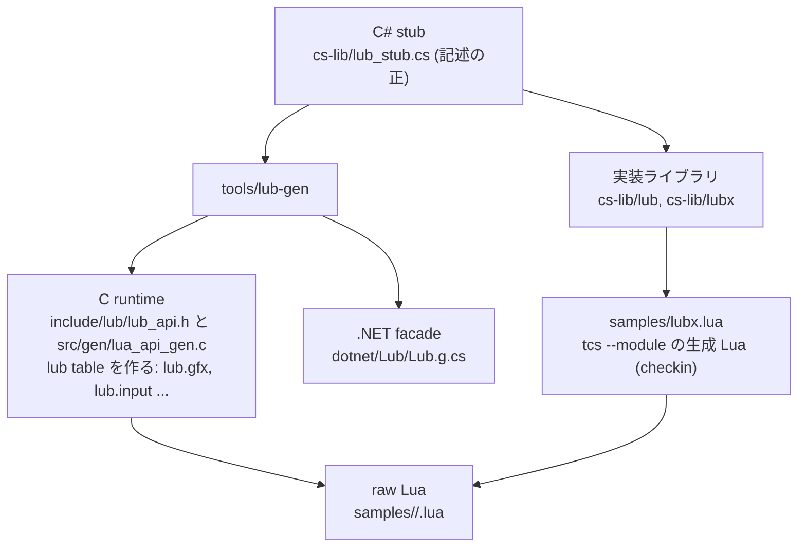

# API glue — 多言語 authoring の接合部

lub のゲームは TinyC# と raw Lua のどちらでも書ける。両方が同じ runtime API
面を見るための接合部と、その上の実装ライブラリの供給方針をまとめる。
記述の正は C# stub(`docs/log/2026-09-04-language-architecture-design.md`)。

## 層構成

- contract 層 — 生成した Lua binding(`src/gen/lua_api_gen.c`)が `lub`
  table を作る。小文字の namespace(`lub.gfx.begin_pass`)が raw Lua と C# の
  面。.NET 実行は同じ記述から生成した facade(`dotnet/Lub/Lub.g.cs`)が
  C API(`include/lub/lub_api.h`)を P/Invoke する。
- binding 層 — C# stub は API 面の記述そのもので、実装を持たない。tcs が
  名前を規則で Lua に写す。
- 実装ライブラリ層 — サンプルの一部という位置付けのコード。ユーザーが
  読み、hot reload で書き換えられることが lub の価値なので、runtime への
  Lua 供給はせず C# で実装する(`cs-lib/`)。raw Lua には tcs が生成した
  `samples/lubx.lua`(`scripts/gen-lubx-lua.sh`)を checkin して届ける。

## 名前の規則

C# の名前が中立表記で、Lua と C の名前は規則で導く(例外表は持たない)。

| 面 | 例 | 規則 |
| --- | --- | --- |
| C# | `Gfx.BeginPass`, `Gfx.PixelFormat.Rgba8`, `Phys2d.World` | 通常の C# 命名(PascalCase) |
| Lua | `lub.gfx.begin_pass`, `lub.gfx.RGBA8`, `lub.phys2d.world` | 先頭を小文字にし、大文字の前に `_` を入れて小文字化。enum メンバは全大文字。namespace は全小文字 |
| C | `lub_gfx_begin_pass`, `LUB_GFX_PIXEL_FORMAT_RGBA8` | `lub_` + namespace + snake_case。enum は `LUB_` + namespace + enum 名 + メンバの全大文字 |

写像は tcs の emit が行う(tcs `doc/support-matrix.md` の「Lua 出力の
名前規則」)。C# 側は `cs-lib/lub_stub.cs` の root class `Lub` に nested
static class(`Gfx`, `Input`, ...)と nested enum を置き、ゲームは
`using static Lub;` で `Gfx.BeginPass(...)` と書く。entry callback は
`OnInit` / `OnEvent` / `OnFrame` / `OnQuit` で、Lua では `on_init` 等になる。

## 各層の対応

| 層 | 場所 |
| --- | --- |
| binding(宣言のみ) | `cs-lib/lub_stub.cs`。PascalCase で宣言し tcs が snake_case に写す |
| 実装ライブラリ | `cs-lib/` に TinyC# で実装(サンプルと一緒に transpile)。raw Lua には `samples/lubx.lua` |
| API reference | stub の XML doc から生成(`scripts/gen-api.sh` → `web/gen/lub-api-docs.json`) |

## 新 API を足す手順

1. `cs-lib/lub_stub.cs` の `Lub` の下に PascalCase で宣言 + doc comment
2. `scripts/gen-api.sh` で header / Lua binding / surface test / API docs / facade を再生成
3. C runtime に `include/lub/lub_api.h` の関数を実装(`src/`)
4. 実装ライブラリの機能なら `cs-lib/` に TinyC# で実装し、`scripts/gen-lubx-lua.sh` で `samples/lubx.lua` を更新

## 接点ファイル

| ファイル | 役割 |
| --- | --- |
| `cs-lib/lub_stub.cs` | C# binding 宣言 = API 面の記述 |
| `cs-lib/` | 実装ライブラリ |
| `samples/lubx.lua` | 実装ライブラリの raw Lua 向け生成物 |
| `web/playground/tcs-compiler.ts` | playground が stub を fetch し `--ref` 相当で渡す |
| `scripts/run-cs-sample.sh` | CLI 外での check / build |
| `tools/lub-gen/` | stub を記述として読む generator。`check`(名前の規則・衝突)、`model`(JSON)、`header`(`include/lub/lub_api.h`)、`lua`(`src/gen/lua_api_gen.c`)、`facade`(`dotnet/Lub/Lub.g.cs`、.NET 実行の P/Invoke)、`docs`(`web/gen/lub-api-docs.json`)、`surface-test`(`tests/lua/test_api_surface.lua`)。まとめて `scripts/gen-api.sh` |

## cs-lib 実装モジュールの供給規約

`cs-lib/` 配下の `*.cs` のうち `lub_stub.cs` だけが `--ref`(宣言のみ、emit されない)。
それ以外は実装ソースとして全 C# サンプルのコンパイル入力に一律追加される
(lub CLI / `run-cs-sample.sh` / playground の 3 箇所とも。サンプル側での選択はしない)。
配置は `cs-lib/lub/<Name>.cs` / `cs-lib/lubx/<Name>.cs`、namespace なしフラット(IDE 用の csproj は両ディレクトリを Compile Include する)。
C# は tcs の naming convention check をそのまま通す(`--no-naming-check` は使わない)。
