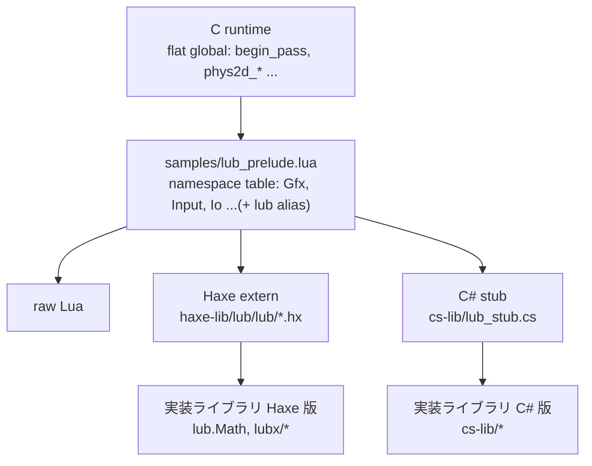

# API glue — 多言語 authoring の接合部

lub のゲームは raw Lua / Haxe / TinyC# のどれでも書ける。全言語が同じ
runtime API 面を見るための接合部と、その上の実装ライブラリの供給方針を
まとめる。

## 層構成

- **contract 層** — prelude が flat global を namespace table に組み立てる。
  全言語共通の正。末尾の `lub` table は Haxe の emit 形
  (`lub.Gfx.begin_pass`) 用 alias で実体は同一 table。
- **binding 層** — 言語ごとの宣言のみ。実装を持たない。
- **実装ライブラリ層** — サンプルの一部という位置付けのコード。ユーザーが
  読み、hot reload で書き換えられることが lub の価値なので、runtime への
  Lua 供給はせず**各言語で実装する**(Haxe / TinyC# の二重実装を許容)。

## 各層の対応

| 層 | Haxe | TinyC# |
| --- | --- | --- |
| binding(宣言のみ) | `haxe-lib/lub/lub/*.hx` extern。`@:native` で camelCase → snake_case | `cs-lib/lub_stub.cs`。snake_case をそのまま宣言し `--ref` で渡す |
| 実装ライブラリ | `lub.Math`, `lubx/*`(サンプルの Lua に同梱コンパイル) | `cs-lib/` に TinyC# で実装(サンプルと一緒に transpile) |
| API reference | extern の doc comment が正(`npm run gen-api`) | stub は宣言 + 最小限の要約のみ |

## 新 API を足す手順

1. C runtime に flat global を実装(`src/`)
2. `samples/lub_prelude.lua` の namespace table に登録
3. Haxe extern に宣言 + doc comment(API reference はここから生成)
4. `cs-lib/lub_stub.cs` に同じ面を宣言
5. 実装ライブラリの機能なら Haxe と TinyC# の両方に実装

## 接点ファイル

| ファイル | 役割 |
| --- | --- |
| `samples/lub_prelude.lua` | contract の正 |
| `haxe-lib/lub/lub/` | Haxe extern(lub.Math のみ実装) |
| `haxe-lib/lub/lubx/` | 実装ライブラリ Haxe 版 |
| `cs-lib/lub_stub.cs` | C# binding 宣言 |
| `cs-lib/` | 実装ライブラリ C# 版 |
| `web/playground/tcs-compiler.ts` | playground が stub を fetch し `--ref` 相当で渡す |
| `scripts/run-cs-sample.sh` | CLI 外での check / build |

## cs-lib 実装モジュールの供給規約

`cs-lib/` 配下の `*.cs` のうち `lub_stub.cs` だけが `--ref`(宣言のみ、emit されない)。
それ以外は実装ソースとして**全 C# サンプルのコンパイル入力に一律追加**される
(lub CLI / `run-cs-sample.sh` / playground の 3 箇所とも。サンプル側での選択はしない)。
配置は `cs-lib/lub/<Name>.cs` / `cs-lib/lubx/<Name>.cs` で `haxe-lib/lub` をミラー、
namespace なしフラット(IDE 用の csproj は両ディレクトリを Compile Include する)。
