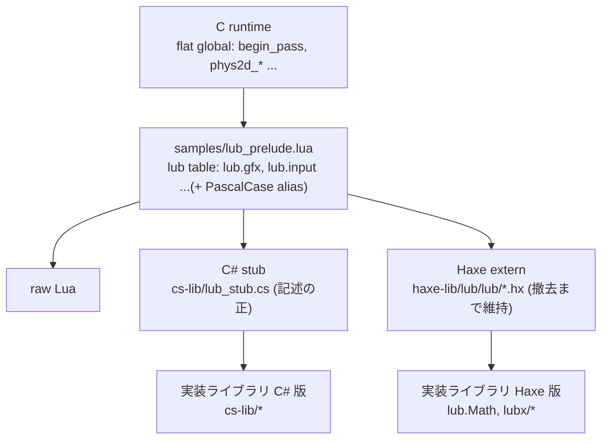

# API glue — 多言語 authoring の接合部

lub のゲームは raw Lua / Haxe / TinyC# のどれでも書ける。全言語が同じ
runtime API 面を見るための接合部と、その上の実装ライブラリの供給方針を
まとめる。Haxe は deprecate 中で、記述の正は C# stub に移した
(`docs/log/2026-09-04-language-architecture-design.md`)。

## 層構成

- contract 層 — prelude が flat global を `lub` table に組み立てる。
  小文字の namespace(`lub.gfx.begin_pass`)が raw Lua と C# の面。
  PascalCase の global(`Gfx.begin_pass`)と `lub.Gfx` は Haxe extern の emit
  形用 alias で、実体は同一 table。`Phys2d` / `Phys3d` / `Ui` / `Audio` /
  `Font` / `Host` は flat global 名(`phys2d_world`)と短名(`world`)の両方を
  持ち、C# は短名側に落ちる。
- binding 層 — 言語ごとの宣言のみ。実装を持たない。C# stub は API 面の記述
  そのもので、tcs が名前を規則で Lua に写す。
- 実装ライブラリ層 — サンプルの一部という位置付けのコード。ユーザーが
  読み、hot reload で書き換えられることが lub の価値なので、runtime への
  Lua 供給はせず各言語で実装する(Haxe 撤去までは二重実装を許容)。

## 名前の規則

C# の名前が中立表記で、Lua と C の名前は規則で導く(例外表は持たない)。

| 面 | 例 | 規則 |
| --- | --- | --- |
| C# | `Gfx.BeginPass`, `Gfx.PixelFormat.Rgba8`, `Phys2d.World` | 通常の C# 命名(PascalCase) |
| Lua | `lub.gfx.begin_pass`, `lub.gfx.RGBA8`, `lub.phys2d.world` | 先頭を小文字にし、大文字の前に `_` を入れて小文字化。enum メンバは全大文字。namespace は全小文字 |
| C(flat global、段階 3 で規則化) | `begin_pass`, `RGBA8`, `phys2d_world` | prelude が対応を持つ |

写像は tcs の emit が行う(tcs `doc/support-matrix.md` の「Lua 出力の
名前規則」)。C# 側は `cs-lib/lub_stub.cs` の root class `Lub` に nested
static class(`Gfx`, `Input`, ...)と nested enum を置き、ゲームは
`using static Lub;` で `Gfx.BeginPass(...)` と書く。entry callback は
`OnInit` / `OnEvent` / `OnFrame` / `OnQuit` で、Lua では `on_init` 等になる
(runtime は Haxe の `onInit` 系にも fallback する)。

## 各層の対応

| 層 | TinyC# | Haxe(deprecate 中) |
| --- | --- | --- |
| binding(宣言のみ) | `cs-lib/lub_stub.cs`。PascalCase で宣言し tcs が snake_case に写す | `haxe-lib/lub/lub/*.hx` extern。`@:native` で camelCase → snake_case |
| 実装ライブラリ | `cs-lib/` に TinyC# で実装(サンプルと一緒に transpile) | `lub.Math`, `lubx/*`(サンプルの Lua に同梱コンパイル) |
| API reference | 撤去後は stub の XML doc から生成する(段階 4) | extern の doc comment が正(`npm run gen-api`) |

## 新 API を足す手順

1. C runtime に flat global を実装(`src/`)
2. `samples/lub_prelude.lua` の namespace table に登録(短名で)
3. `cs-lib/lub_stub.cs` の `Lub` の下に PascalCase で宣言 + doc comment
4. Haxe extern に宣言(撤去まで)
5. 実装ライブラリの機能なら TinyC# で実装(Haxe 版は凍結)

## 接点ファイル

| ファイル | 役割 |
| --- | --- |
| `samples/lub_prelude.lua` | contract の正(`lub` table) |
| `cs-lib/lub_stub.cs` | C# binding 宣言 = API 面の記述 |
| `cs-lib/` | 実装ライブラリ C# 版 |
| `haxe-lib/lub/lub/` | Haxe extern(lub.Math のみ実装、撤去まで) |
| `haxe-lib/lub/lubx/` | 実装ライブラリ Haxe 版(凍結) |
| `web/playground/tcs-compiler.ts` | playground が stub を fetch し `--ref` 相当で渡す |
| `scripts/run-cs-sample.sh` | CLI 外での check / build |
| `tools/lub-gen/` | stub を記述として読む generator。`check`(名前の規則・衝突)、`model`(JSON)、`surface-test`(`tests/lua/test_api_surface.lua`: prelude が全 member を持つかの Lua テスト) |

## cs-lib 実装モジュールの供給規約

`cs-lib/` 配下の `*.cs` のうち `lub_stub.cs` だけが `--ref`(宣言のみ、emit されない)。
それ以外は実装ソースとして全 C# サンプルのコンパイル入力に一律追加される
(lub CLI / `run-cs-sample.sh` / playground の 3 箇所とも。サンプル側での選択はしない)。
配置は `cs-lib/lub/<Name>.cs` / `cs-lib/lubx/<Name>.cs` で `haxe-lib/lub` をミラー、
namespace なしフラット(IDE 用の csproj は両ディレクトリを Compile Include する)。
C# は tcs の naming convention check をそのまま通す(`--no-naming-check` は使わない)。
