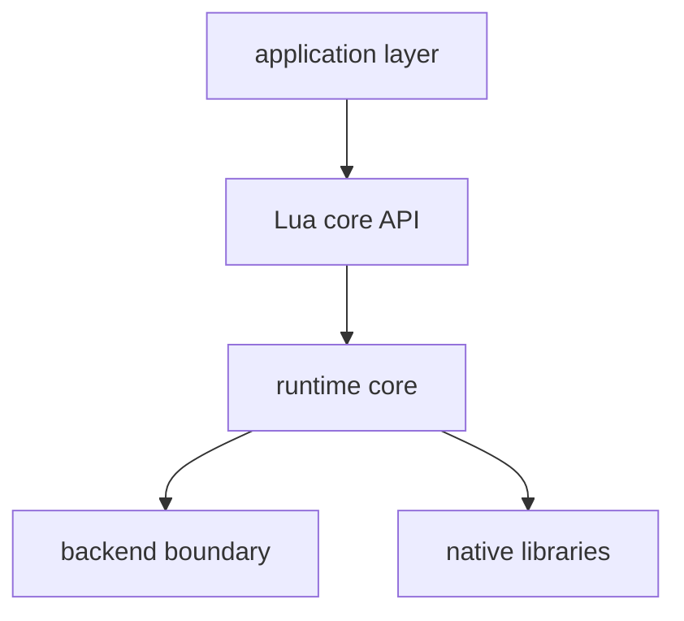

# lub Design

lub は、細部までこだわったゲーム体験を作るためのコード中心のゲーム開発環境である。
最重要の価値は、ゲームを止めずに変更を反映し、トライアンドエラーを極限まで速くすること。

## Why

AI が自動生成する平均的な体験ではなく、人間が細部まで調整しきった体験を作れる環境がほしい。
そのためには、asset、描画、入力、物理、音、診断情報をコードから直接制御でき、変更が即座に動作へ反映される必要がある。

lub は GUI editor や特定 asset pipeline を中心に据えず、開発者が自分のゲームに必要なデータ構造と workflow をコードで組める余地を残す。

## To Be

- ゲームをコード中心に組み立てられる。
- 実行中のゲームを止めずに、コードや asset の変更を即座に反映できる。
- runtime 基盤は C/C++ と既存ライブラリを再利用し、移植性と native integration を保つ。
- Lua を runtime API の接点にし、Haxe は Lua を生成する script authoring layer として扱う。
- 3D graphics を標準の描画基盤として持ち、2D game もその上で自然に扱える。
- core API は最小の固い primitive に絞る。
- core API の外側は runtime 外の Lua library と app code が担う。

Lua を使う理由として、reload 時に data shape の変化へ追従しやすいことを重視する。
Haxe はその性質を活かしたまま、より書きやすい script authoring を提供するために使う。

script authoring layer は複数言語を許す。Haxe に加えて TinyC#
([tcs](https://github.com/neguse/tcs)、C# サブセット → Lua transpiler) を
第二の authoring 言語とする。全サンプルを Haxe / C# の両言語で提供する
(番号付きサンプルは両対応済み)。サンプル番号は言語で分けず、同一サンプルディレクトリに両言語の
ソースを同居させ、開く言語を選ぶ (対応状況の正は `web/playground/samples.ts` の
CS_SAMPLES と `samples/*/<Entry>.cs` の有無)。web playground は Haxe と C# の
両方を動く状態に保つ: コンパイラは言語別に分離し、player・Lua API 面
(prelude)・hot reload セマンティクスは言語間で共有する。native CLI も対称で、
`lub <sample>.hxml` と `lub <sample>/<Entry>.csproj` が同じ DX
(build + watch + hotswap) を持つ。csproj は IDE 用の実プロジェクト
でもあり、lub は basename (= entry class) しか読まない。

## Non-Goals

- 既存 framework / engine の API 互換。
- 特定ゲームの元実装をそのまま載せるための alias や shortcut。
- 分業用 GUI authoring tool。
- 実行時 performance の最大化。大量 object や巨大 scene の処理は主目的ではない。
- AI ベース開発にしか役に立たない機能。
- WebGL fallback。web は WebGPU 必須とする。core API が compute / storage buffer を
  一級で持つため WebGL2 には収まらず、対応するなら core API のサブセット化という
  別の決断になる。WebGPU の無い環境 (古い iOS、Vulkan driver がブロックリストに
  載った Android の Chrome) は配布対象外
  (経緯: `docs/log/2026-07-07-backend-consolidation.md`)。

## Core API Boundary

lub core は、runtime が所有しなければ一貫性を保てない primitive だけを持つ。
それ以外は runtime API にしない。

core が所有するもの:

- 実行の境界: 起動、終了、frame、time step。
- 外部状態の snapshot: 入力や環境状態を frame 内で一貫して読むための境界。
- resource identity: resource の名前、寿命、version、reload の一貫性。
- backend abstraction: platform/backend 差分を Lua 側へ漏らさないための command 境界。
- diagnostics: runtime 内部状態を観測し、再現と検証に使える情報。

core が所有しないもの:

- gameplay semantics。
- content semantics。
- application workflow。
- compatibility surface。
- authoring tools。

同じ処理が複数箇所で必要になっても、それだけでは core に入れない。
runtime invariant、resource lifetime、backend abstraction、hot reload、diagnostics のどれかを runtime が守る必要がある場合だけ core API として扱う。

### Script API 面

- C runtime が expose する flat global (`begin_pass`, `phys2d_*`, ...) は wire ABI
  であり、公式 API 面ではない。
- 公式面は namespace table (`Gfx` / `Input` / `Phys2d` / ...)。
  `samples/lub_prelude.lua` が flat global から組み立て、boot.lua が entry
  require の前に注入する。全 authoring 言語 (raw Lua / Haxe / TinyC#) が
  同じ面を見る。
- `lub.Gfx` 等の `lub.*` は Haxe extern の emit 形のための alias で、実体は
  同一 table。Haxe 固有の互換層 (lua-utf8 / bit32 / math.atan2) だけが
  HAXE_PRELUDE (`src/embedded_prelude.h`) に残る。

API の細かいシグネチャや binding の制約は、この文書ではなく記述側に置く。
一次情報は `cs-lib/lub_stub.cs`(C# の stub が API の記述)で、C API の
header(`include/lub/lub_api.h`)と Lua binding(`src/gen/lua_api_gen.c`)は
`tools/lub-gen` がそこから生成する(`scripts/gen-api.sh`)。
Lua の数値は `LUA_32BITS`(整数 32 bit、実数 float)で、C API の面
(int32_t / float)と C# の int / float に揃える。64 bit の値は面に出さない。

## Runtime Shape

`RenderBackend` vtable で backend 差分を閉じ込め、Lua core API には漏らさない。
`pass.c` / `pipeline.c` / `resources.c` / `capture.c` は backend を呼び出す glue に留める。

`diag` は core API に置く。
log、capture、resource dump、runtime state dump のような情報取得は、人間の debug と自動検証の両方で必要になるため。

## Current Constraints

- macOS は未対応。
- sdlgpu backend は native 専用。web は webgpu backend のみ。
- `native` はプラットフォーム直接実装 (Windows: D3D12、Linux: Vulkan)。CI golden は
  Windows は WARP、Linux は lavapipe で回す (`docs/dx12-backend.md`)。backend 構成の
  整理方針は `docs/log/2026-07-07-backend-consolidation.md`。
- swapchain capture (`--capture`) は native のみ。web は `Gfx.readback(key)` による
  render target readback のみ。
- SDL GPU path は combined image sampler 周辺に制約がある。
