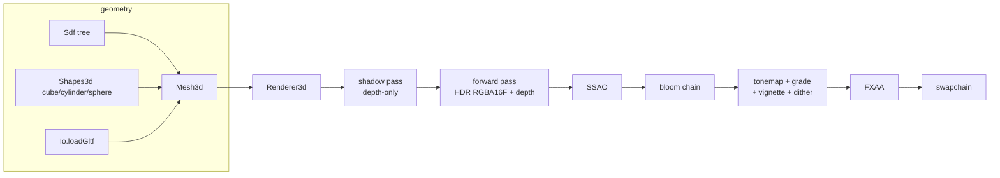

# Renderer3d 設計

lubx に載せる小さな組み込み 3D レンダラ。目標は「メッシュを投げたら一発でいい絵」。
サンプル 18/22/23/25 が毎回コピペしている lit shader・単位メッシュ・draw ラッパ・
pose 変換と、19/22/24 の skinned 定型をライブラリに昇格し、その上に
forward + HDR + ポストエフェクトの既定スタックを足す。

## 決定事項と根拠

調査(Filament / Godot 4 / Bevy / bgfx / WebGPU 仕様議論の一次ソース)から:

- **forward 一本。deferred にしない。** WebGPU は subpass / tile-memory 相当を欠き、
  pass 間の G-buffer がメインメモリを往復する(TBDR 実測 40% 級のペナルティ)。
  Filament は clustered forward、Godot 4 は 3 レンダラ全て forward 系で、
  小〜中規模エンジンに deferred の採用例が無い。
- **forward+ (clustered) にもしない。** 光源カリング基盤は多光源時のみペイする。
  lub のゲームは光源数個で足りるので、uniform 配列の N 光源ループで十分。
  多光源が要る日が来たら同じ API のまま内部を clustered 化する。
- **material は固定ライティングモデル + パラメータ入力。** shader graph を持つ
  小規模エンジンは無い。頂点 color + metallic/roughness(`interleavePncm` の形式)を
  エンジン所有の shader が評価する。カスタムは Slang ソース差し替え。
- **render graph は作らない。** Filament(FrameGraph は内部専用)も Godot も
  user-facing の pass 抽象を公開していない。固定チェーン + 効果別オプションで足りる。
- **既定は「盛る」。** Filament の既定 OFF 主義は色の正確性を守る汎用エンジンの事情。
  lub は「デフォルトでオッとなる絵」が価値なので、既定 ON で出荷する。

## 全体像



## モジュール構成

### lubx.Mesh3d — geometry 層

`lub.Mesh.MeshData`(SDF / glTF / 手続き生成が共有する規約)を GPU buffer まで
面倒を見るインスタンス。

- `new Mesh3d(key)` / `rebuild(data:MeshData)` — rebuild が内部 version を
  インクリメントする。`os.clock` による version 捏造は廃止。
- MeshData に `bones` があれば `interleavePncmw`(skinned)、無ければ
  `interleavePncm`(static)を自動選択。
- vertex layout は pncm(w) 固定: pos.xyz + normal.xyz + color.rgb + metal_rough.xy
  (+ skin j0,w0,j1,w1)。これが Renderer3d の material 契約。

### lubx.Shapes3d — 単位プリミティブ

`cube()` / `cylinder(sides)` / `sphere(stacks, slices)` が MeshData 形式
(indexed、pos+normal+白色)を返し、Mesh3d に流す。頂点色が白なので
draw 側の tint がそのまま albedo になる。
`fromInterleaved(v)` は既存 `Shapes`(stride 10、非 indexed)の生成結果を
MeshData へ変換するブリッジ(24_baseball のフィールドが使う)。
既存 `Shapes` 自体は sfb / 11_shadow 用にそのまま残す。

### lubx.Bones — skinned 定型

19/22/24 で共通の暗黙契約を昇格:

- `Bones.pivotRot(px, py, pz, rot:Mat4):Mat4` — T(p)·R·T(−p)。
- `Bones.pack(mesh:MeshData, resolve:(name:String)->Mat4):Table<Int,Float>` —
  mesh.bones の並び順で最大 8 本を mat4 × 8 = 128 float に詰める。
  アニメーション(何をどう振るか)はゲーム側の仕事のまま。

### lubx.Renderer3d — パイプライン

```haxe
var ren = new Renderer3d("main");            // key prefix。既定全部入り
// 毎フレーム:
ren.begin({eye: eye, target: tgt, fov: 38}); // Camera3d と同じ opts
ren.draw(pinMesh, model);                     // Mesh3d + model 行列
ren.draw(boxMesh, m2, {color: tint, blend: Gfx.ALPHA});
ren.draw(charMesh, m3, {bones: packed});      // skinned
ren.end();                                    // チェーン実行 → swapchain へ
// 作風調整(効果別オプション、Filament View / Godot Environment と同形):
ren.light.dir = new Vec3(-0.4, 1.0, -0.55);
ren.bloom.strength = 0.4;
ren.ssao.enabled = false;
ren.fog = {color: ..., density: ...};         // opt-in 系
```

- `draw()` は記録のみ。`end()` が opaque → blend の順に各 pass を実行する。
- pose 定型 `poseMat`(Phys3d pose → Mat4)もここに置く
  (`Renderer3d.poseMat(pose)`、4 サンプルで byte 一致していた 1 行)。
- material 差し替えは per-draw opts で: `shader`(Slang 差し替え。必要な
  uniform 名だけ宣言すればよい)+ `textures` / `uniforms`(追加バインド。
  19_sdf の matcap、view 行列などはこの口で渡す)。
- `viewProj`(y-flip なしの view-projection)と `viewMat` を公開する。
  world → スクリーン投影(頭上ラベル等)と差し替え shader の view-space
  計算用。
- `debugView = "ao" | "bloom" | "hdr"` で中間バッファを直接表示(チューニング用)。

**色空間の契約**: tint・頂点色(SDF の paint 含む)・background・fog/outline の
色は sRGB 感覚で書く。Renderer3d が linear 化(^2.2)してライティングし、
AgX が display に戻す。差し替え shader が自前で色を作る場合は
linear で返すこと(19_sdf の fs 末尾参照)。

## パスとエフェクトの既定

効きが大きい順に、既定 ON:

| 効果 | 実装 | 既定 |
| --- | --- | --- |
| tonemap | AgX 近似(fitted curve)、exposure 付き | ON |
| 空の環境光 | hemispheric ambient(sky/ground 2 色) | ON |
| shadow | 平行光源 1 本、depth-only pass → PCF 3×3、2048 | ON |
| SSAO | 半解像度、depth から法線再構成、blur 1 回、HDR に乗算合成 | ON |
| bloom | soft-knee 抽出 → 1/2 縮小チェーン 5 段 → 加算アップサンプル | ON |
| AA + dither | FXAA(tonemap 後の LDR に)+ triangular dither | ON |
| fog / outline / vignette | 単純な depth fog / 法線+depth エッジ / 周辺減光 | opt-in |

- HDR シーンターゲットは RGBA16F。offscreen の y-flip(swapchain との向きの差、
  `proj.m[5]` 反転と 2 種類の quad)は Renderer3d が内部で吸収し、ユーザーには
  二度と書かせない。
- HUD / テキスト / ImGui は `end()` の後に
  `Gfx.beginPass({target: Gfx.mainTex, load: Gfx.LOAD})` で重ね描きする
  (tonemap の外なので色がそのまま出る)。
- SSAO はライティング済み HDR への乗算(sfb と同方式)。depth prepass を増やさない
  ための割り切りで、stylized な絵では十分。
- shader は全て Haxe 文字列で埋め込み(MeshText 前例)。`draw()` opts の
  `shader` 差し替えで material をカスタムできる(19 の matcap、24 のチーム色 tint は
  この口で表現する)。差し替え shader は `Io.loadText` 経由なら従来通り hot reload が効く。
- 乱数は使わない(SSAO カーネル固定、dither は screen 座標ハッシュ)。headless
  golden capture の決定性を保つ。

## 必要な Gfx API 拡張(コンパクト維持)

1. **PassOpts に `?load:Int`**(`Gfx.LOAD` / `CLEAR`)。enum は enums.h に定義済みで
   未配線。Renderer3d が swapchain へ present した後、ゲームが UI / テキストを
   重ね描きするために必須(現状は pass 開始で常に clear される)。
2. **depth テクスチャの直接サンプリングの検証**。vk / webgpu は sampled view 対応済み。
   sdlgpu / dx12 を検証し、通れば shadow pass は depth-only
   (`PassBeginDesc.n_color_targets = 0`、定義済み)で RGBA8 への depth 書き写しを廃止。
3. 見送り: mipmap(bloom は縮小 RT 連鎖で足りる)、MSAA(FXAA で代替)、
   compare sampler(PCF 品質を上げたくなった時の第二段)。

## 移行と役割分担

- 25_bowling → 23_crane_game → 22_tonton → 18_coin_pusher → 19_sdf → 24_baseball の順に
  Renderer3d + Mesh3d へ移行(lit slang コピペ・buildCube 群・poseMat・boneMat を粉砕)。
- **12_sfb は移行しない**。素の Gfx でパイプラインを手組みする教材として残す
  (deferred 系の実装例という価値も含めて)。
- lubx 変更後は `cd web && npm run gen-haxe` を忘れない(in-browser コンパイラの
  std-bundle 焼き込み)。

## 検証

- golden(native / sdlgpu、lavapipe byte 一致)に `26_renderer3d` と
  Gfx 拡張の visual test(`test_load_op` / `test_depth_sample`)を追加済み。
- webgpu は playwright(swiftshader)で 26 と移行サンプルの実描画を確認済み。
  dx12 はコード検査のみ(Windows 機で golden を回すこと)。
- 決定性: 乱数不使用(SSAO カーネル固定・dither は座標ハッシュ)。
- 性能: lavapipe(CPU)で 25_bowling 全部盛り 300 frame が 12_sfb の約 1/3 の
  時間。実 GPU では問題にならない。効果の負荷を下げたいときは SSAO 半解像度の
  さらに下げ、bloom 段数削減で調整する。
